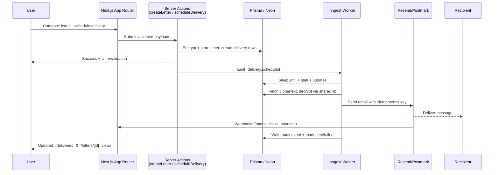

# DearMe Customer Journey & Workflow Map

This document stitches together everything a customer touches—from the first scroll on the marketing site through durable delivery jobs and retention workflows—using the current codebase as the source of truth.

## Visual Journey Overview
```mermaid
flowchart LR
  subgraph Awareness
    LP[Landing Page & Write-Letter Demo]
    CTA[CTA Buttons & Navbar]
  end

  subgraph Activation
    SI[Clerk Sign In/Up]
    Dash[Dashboard]
    Editor[Letter Editors<br/>(/letters/new & dashboard)]
  end

  subgraph Scheduling
    Detail[Letter Detail]
    ScheduleForm[Schedule Delivery Form]
    Billing[Stripe Billing & Entitlements]
  end

  subgraph Fulfillment
    Prisma[(Neon / Prisma)]
    Inngest[(Inngest Functions)]
    Resend[Resend/Postmark]
    Recipient[Recipient Inbox or Mailbox]
  end

  subgraph Feedback
    Audit[Audit Log]
    DeliveriesPage[/deliveries overview]
    Settings[Account & Data Settings]
  end

  LP --> CTA --> SI --> Dash --> Editor --> Detail --> ScheduleForm --> Billing
  ScheduleForm --> Prisma --> Inngest --> Resend --> Recipient
  Resend --> DeliveriesPage
  Prisma --> Audit --> Settings
  Inngest --> DeliveriesPage
```

## Delivery Workflow Sequence


## 0. Shared Product Context
- DearMe positions itself as a “privacy-first platform for scheduling messages to your future self,” powered by Next.js 15, Clerk, Neon, Inngest, Resend, Stripe, Upstash, and Lob (optional) (`README.md:1-69`).
- The architecture doc shows how the browser, Vercel edge, Clerk, Neon, Inngest, Resend, Stripe, Lob, and Redis fit together, and outlines the delivery step-function the rest of this map references (`ARCHITECTURE.md:5-140`).

## 1. Awareness & Consideration (Public Surfaces)
- **Marketing narrative + CTA loops** – The landing page walks prospects through value props, “set the moment → pour your heart out → let us deliver,” social proof, and CTA buttons that jump to “Write a Letter” or “How it Works” sections (`apps/web/app/(marketing)/page.tsx:74-200`). The sticky `Navbar` keeps “Try Editor,” “How It Works,” and “Get Started” actions in view with sign-in/up affordances (`apps/web/components/navbar.tsx:6-64`).
- **Try-before-sign-up editor** – Anonymous visitors can draft in the brutalist editor, pick preset time horizons, and see validation before being nudged to create an account. This reuses the same `LetterEditorForm` used post-login so the writing experience feels consistent (`apps/web/components/letter-editor-form.tsx:1-200`).
- **Alternate entry points** – `/write-letter` mirrors the marketing hero but dedicates the whole page to the editor, tips, and prompts to help hesitant writers reach activation (`apps/web/app/write-letter/page.tsx:1-120`).

## 2. Account Creation & Authentication
- **Clerk-hosted flows** – Dedicated sign-in and sign-up routes render Clerk components with tailored copy that redirect to `/dashboard` on success (`apps/web/app/sign-in/[[...sign-in]]/page.tsx:1-31`, `apps/web/app/sign-up/[[...sign-up]]/page.tsx:1-30`).
- **Route protection** – Clerk middleware shields every route except marketing pages, auth routes, webhooks, and the Inngest endpoint, forcing authentication before the app shell renders (`apps/web/middleware.ts:1-19`).
- **Dual user-sync strategy** – `getCurrentUser` first queries Prisma, but can auto-create a user by pulling from Clerk if the webhook lagged, keeping local data consistent (`apps/web/server/lib/auth.ts:1-82`).
- **Lifecycle webhooks** – The Clerk webhook handler creates profiles with default timezones, updates email addresses, and anonymizes/cancels data on deletion (letters soft-delete, deliveries cancel) so legal/accounting flows stay compliant (`apps/web/app/api/webhooks/clerk/route.ts:1-149`).

## 3. Post-signup Surfaces (Dashboard & Navigation)
- **Dashboard home** – Authenticated users land on `/dashboard`, which presents summary cards (currently static), a “Quick Write” badge, and embeds the editor to remove friction in drafting the next letter (`apps/web/app/(app)/dashboard/page.tsx:1-124`).
- **Client-side quick composer** – `DashboardLetterEditor` reuses `LetterEditorForm` but currently short-circuits to a toast/alert; wiring it into the server action would collapse steps for repeat writers (`apps/web/components/dashboard-letter-editor.tsx:1-28`).
- **Primary nav** – Inside the `(app)` layout, users can jump between dashboard, letters, deliveries, and settings, mirroring the file structure called out in the architecture doc (`ARCHITECTURE.md:52-62`).

## 4. Authoring Letters
- **Authoring UI** – `/letters/new` wraps `NewLetterForm`, which collects title/body today and forwards into the server action. Validation, date presets, and recipient email capture live inside the shared `LetterEditorForm` (`apps/web/components/new-letter-form.tsx:8-51`, `apps/web/components/letter-editor-form.tsx:31-200`).
- **Server action pipeline** – `createLetter` enforces schema validation, encrypts HTML + rich JSON, persists the record, logs an audit event, and triggers a “letter created” Inngest notification before revalidating relevant pages (`apps/web/server/actions/letters.ts:1-135`). Schema constraints (title, body formats, tags, visibility) are defined centrally under `@dearme/types` so both client and server share guardrails (`packages/types/schemas/letter.ts:1-19`).
- **Encryption + storage** – Letters are stored as ciphertext/nonce/keyVersion columns, all generated by AES-256-GCM helpers that pull a master key from env so vault contents stay private even from operators (`apps/web/server/lib/encryption.ts:1-133`, `packages/prisma/schema.prisma:68-133`).
- **Audit + observability** – Every create/update/delete action logs an `audit_events` row for later SOC/GDPR work (`apps/web/server/actions/letters.ts:96-134`, `packages/prisma/schema.prisma:188-211`).

## 5. Planning Deliveries
- **Letter detail as a hub** – `/letters/[id]` shows decrypted content, a prominent “Schedule Delivery” CTA, and a timeline of previously scheduled deliveries with status pills and timezone context (`apps/web/app/(app)/letters/[id]/page.tsx:15-99`).
- **Scheduling UX** – The schedule page hosts a client form with delivery method toggle (mail disabled for now), date/time pickers, timezone hints, and success/error toasts before redirecting back to the letter (`apps/web/app/(app)/letters/[id]/schedule/page.tsx:1-20`, `apps/web/components/schedule-delivery-form.tsx:16-141`).
- **Server+schema enforcement** – `scheduleDelivery` revalidates inputs (channel, timezone, optional shipping info) using `scheduleDeliverySchema`, asserts ownership, creates the delivery row plus the channel-specific child record, and emits the Inngest event, keeping audit trails in sync (`packages/types/schemas/delivery.ts:1-41`, `apps/web/server/actions/deliveries.ts:1-191`).
- **Data model considerations** – Deliveries capture channel, desired timestamp, timezone-at-creation, ingress run IDs, and attempt counts, while email + mail tables track provider IDs, opens/clicks, print options, preview URLs, and shipping metadata for future physical flows (`packages/prisma/schema.prisma:136-208`).

## 6. Billing & Entitlements
- **Business rule** – Architecture notes call out that scheduling is a Pro feature with trials, physical mail surcharges, and a Stripe-backed subscription (`ARCHITECTURE.md:162-177`).
- **Stripe integration** – A provider wrapper instantiates Stripe, exposes helpers for Checkout and the customer portal, and is wired to use per-user metadata for reconciliation (`apps/web/server/providers/stripe.ts:1-52`).
- **Webhook bookkeeping** – The Stripe webhook handler syncs subscription status into Prisma, records payments (succeeded/failed) tied to `userId` metadata, and marks canceled subscriptions, ensuring downstream entitlement checks can rely on a single table (`apps/web/app/api/webhooks/stripe/route.ts:1-135`).
- **Profile linkage** – Profiles store `stripeCustomerId` references so customer/subscription rows can be matched to users when Stripe-originated events arrive (`packages/prisma/schema.prisma:36-75`).
- **Current UI state** – The settings screen explains Pro benefits but keeps billing controls behind “coming soon” badges, signalling where the next UI work should hook in (`apps/web/app/(app)/settings/page.tsx:156-190`).

## 7. Delivery Pipeline & Notifications
- **Event fan-out** – Scheduling fires two Inngest events: `delivery.scheduled` (core fulfillment) and `notification.letter.created` (user confirmation), both exposed through the `/api/inngest` handler so Inngest Cloud or Dev Server can invoke workers (`apps/web/server/actions/letters.ts:108-125`, `apps/web/server/actions/deliveries.ts:139-151`, `apps/web/app/api/inngest/route.ts:1-10`).
- **Operational workflow** – `deliver-email` waits until `deliverAt`, marks status transitions, decrypts content, sends via the active email provider (Resend or Postmark based on feature flags), records audit events, and handles retries/error classification before failing deliveries definitively (`workers/inngest/functions/deliver-email.ts:1-400`, `apps/web/server/providers/email/index.ts:1-35`, `apps/web/server/lib/feature-flags.ts:1-139`, `workers/inngest/lib/errors.ts:1-190`).
- **Customer notifications** – `send-letter-created-email` fetches the user/profile, double-checks the letter still exists, renders React Email templates, and sends an idempotent confirmation so writers know the draft landed in their vault (`workers/inngest/functions/send-letter-created-email.ts:1-205`).
- **Provider feedback** – The Resend webhook increments opens/clicks, records bounces/complaints, and flips delivery status to failed so the UI can expose accurate telemetry (signature verification is still marked TODO) (`apps/web/app/api/webhooks/resend/route.ts:1-82`).

## 8. Customer-Facing Tracking & Data Surfaces
- **Letters index** – `/letters` lists every encrypted letter without loading bodies, shows counts of scheduled deliveries, and shortcuts to creation when empty (`apps/web/app/(app)/letters/page.tsx:1-133`).
- **Deliveries index** – `/deliveries` visualizes future/past jobs with status colors, channel icons, deliverAt in local format, and timezone hints, linking back to the originating letter for edits (`apps/web/app/(app)/deliveries/page.tsx:1-144`).
- **Settings** – Centralizes account metadata, timezone copy, future notification toggles, subscription messaging, privacy assurances, and a “danger zone” stub for deletion requests (`apps/web/app/(app)/settings/page.tsx:1-200`).
- **Profile + addresses** – Prisma models capture shipping addresses (for Lob/ClickSend), so future UI can let customers manage verified destinations ahead of physical deliveries (`packages/prisma/schema.prisma:210-260`).

## 9. Reliability, Monitoring & Governance
- **Cron backstop** – A Vercel Cron endpoint scans for past-due deliveries every five minutes, re-enqueues up to 100 stuck jobs, logs audit events, and watches reconciliation rate vs the 0.1% SLO (`apps/web/app/api/cron/reconcile-deliveries/route.ts:1-133`, `PHASE_IMPLEMENTATION.md:29-45`).
- **Audit + rate limiting + cache** – Architecture decisions lock in audit logging, pg_trgm search, redis-backed rate limits for APIs and mutations, and a cache strategy for profiles and lists (`ARCHITECTURE.md:98-200`).
- **Error classification** – Worker helpers tag provider/database failures as retryable or not, set idempotency keys, and enforce exponential backoff to keep the promises in-flight reliable (`workers/inngest/lib/errors.ts:1-190`, `PHASE_IMPLEMENTATION.md:49-60`).
- **Feature-flag-driven rollouts** – Unleash-ready flag helpers (with env fallbacks) let the team toggle Postmark, physical mail, templates, ClickSend, or future client-side encryption per environment without redeploys (`apps/web/server/lib/feature-flags.ts:1-139`, `PHASE_IMPLEMENTATION.md:115-140`).
- **Security posture** – Letters stay encrypted, secrets live in env, and Clerk middleware plus server-side ownership checks prevent cross-tenant data leaks (`apps/web/server/lib/encryption.ts:1-133`, `apps/web/server/actions/letters.ts:17-135`).

## 10. Future States & Gaps to Close
- **In-flight roadmap items** – DST education, template picker UI, arrive-by logic, ClickSend provider, OpenTelemetry tracing, PostHog analytics, end-to-end tests, admin console, and GDPR DSR workflows remain outstanding per the phase tracker (`PHASE_IMPLEMENTATION.md:63-200`).
- **Entitlement UX & metering** – Pro gating exists in the business spec but the dashboard/settings still show placeholders, and server actions don’t yet enforce subscription state before scheduling; Stripe metadata + subscription tables make that check straightforward once implemented (`ARCHITECTURE.md:162-177`, `apps/web/server/actions/deliveries.ts:21-190`, `apps/web/app/(app)/settings/page.tsx:156-190`).
- **Physical mail fulfillment** – DB schemas already support arrive-by targeting, transit buffers, Lob job IDs, and shipping addresses, but UI + providers are toggled off, so publishing that workflow will require wiring the “mail” path in the scheduling form plus Lob webhooks (`packages/prisma/schema.prisma:136-208`, `apps/web/components/schedule-delivery-form.tsx:75-139`, `PHASE_IMPLEMENTATION.md:170-199`).
- **Analytics & lifecycle loops** – PostHog funnels and the “Sign Up → First Letter → First Delivery” lifecycle mentioned in the roadmap need instrumentation because nothing currently emits client/server events beyond audits (`PHASE_IMPLEMENTATION.md:189-214`).
- **Resend webhook hardening** – Signature verification is explicitly marked TODO, so hardening that endpoint is necessary before GA to block spoofed events (`apps/web/app/api/webhooks/resend/route.ts:4-32`).
- **Testing & observability gaps** – Critical path tests, OTel traces, and better worker telemetry are all flagged in Phase 1/3 as pre-GA requirements; finishing them will make the delivery promise auditable (`PHASE_IMPLEMENTATION.md:63-118`, `PHASE_IMPLEMENTATION.md:200-230`).

By following these stages end-to-end you can see how every customer touchpoint corresponds to concrete codepaths, database tables, and background jobs, and where the remaining work sits to complete the DearMe experience.
